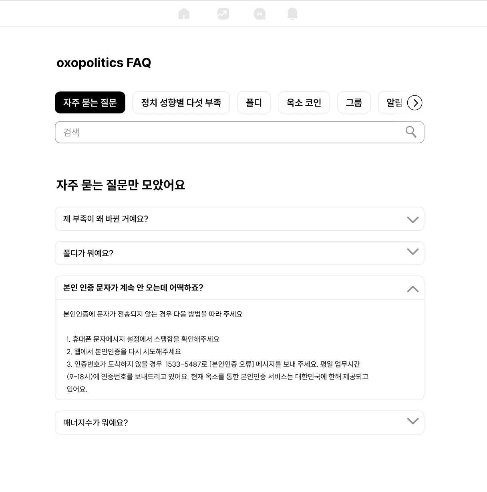

# 배포링크
> [https://qna-board-young.vercel.app](https://qna-board-young.vercel.app/)

 
 
<h1>oxopolitics QnA 게시판입니다!</h1>

## Description of Project

### Why?
현재 옥소폴리틱스의 QnA 게시판이 Notion으로 만들어져 있습니다.  
저희는 Notion 대신 옥소폴리틱스의 웹 서비스로 구현을 하였습니다.

### What?
<a href="https://faq.oxopolitics.com/">옥소폴리틱스 QnA</a>의 노션으로 디자인 된 Q&A를 웹페이지로 제작하였습니다.  

### Preview

 
 
 

### Tech Stacks

<!-- JavaScript -->

<!-- React -->

<!-- Vite -->

<!-- Styled Components -->

<!-- FireBase -->

### Crew Info

| TEAM                | Position | Blog                                                      | Github                                                     |
| ------------------- | -------- | --------------------------------------------------------- | ---------------------------------------------------------- |
| :wink: 이소윤       | FrontEnd | <a href="https://programmerplum.tistory.com/">tistory</a> | <a href="https://github.com/99dlthdbs">@99dlthdbs</a>      |
| :sunglasses: 이기문 | FrontEnd | <a href="https://velog.io/@kimoon212">velog</a>           | <a href="@kimoon1 ">@kimoon1</a>                           |
| :laughing: 정영훈   | FrontEnd | <a href="https://youngst.tistory.com/7">tistory</a>       | <a href="https://github.com/young-st511">@young-st5111</a> |

